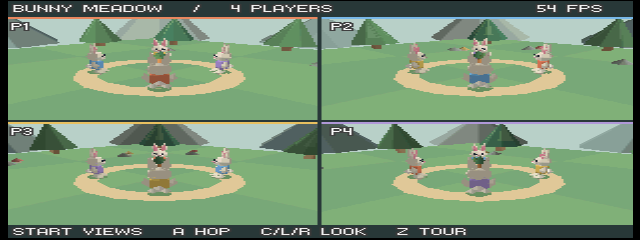
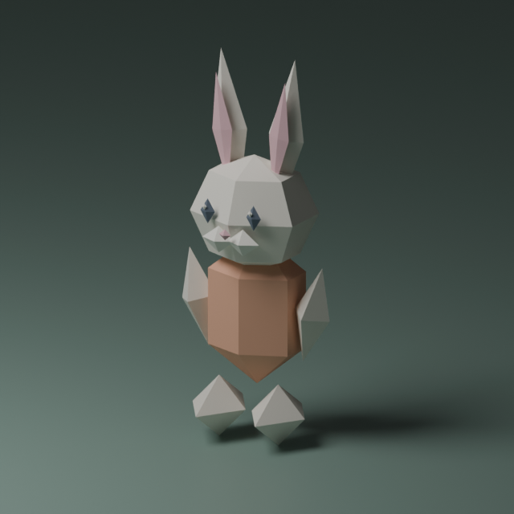

# Bunny Meadow — N64 3D split-screen template

A Zig-first Nintendo 64 template with one shared 3D world, four little rabbit
characters, and **1–4 independent third-person cameras**. Triangles, depth
buffering, antialiasing, clears, and text are drawn by **libdragon RDPQ**.
**Tiny3D runs transforms and clipping on the RSP**. The archived pre-audio,
untextured four-player emulator benchmark sustained 40+ FPS. Gameplay and mesh preparation remain in Zig.
There is no CPU framebuffer rasterizer.



## Play

The ROM opens in four-player mode. All four rabbits exist in the world even
when fewer cameras are displayed; each controller always owns its matching
rabbit. A controller is not required to see the initial demonstration.

| N64 control | Action |
| --- | --- |
| Stick / D-pad | Move relative to that player's camera |
| A | Hop |
| C-left / C-right, or L / R | Orbit that player's camera |
| B | Recenter camera behind the rabbit |
| Player 1 Start | Cycle 4 → 1 → 2 → 3 → 4 views |
| Player 1 Z | Toggle the automatic walking/camera tour |
| Player 1 C-down | Reset the shared world |
| Player 1 C-up | Pause / resume |

One player fills the screen. Two players use horizontal halves. Three use a
wide top view and two lower views. Four use quadrants. Projection uses each
view's actual dimensions, with RDP scissoring preventing any drawing across
the separators. `OFF` marks a disconnected controller without removing its
rabbit. Release all controls after boot, reconnect, reset, or pause/resume to
rearm input. [Multiplayer lifecycle](docs/multiplayer.md) describes participation,
visible-port mapping, and the small pause/reset interface for game forks.

## Build and run

Mise installs pinned Nushell 0.115.1, Just 1.58.0, Zig 0.16.0 and actionlint.
The Justfile is the public task interface; native Nushell scripts own builds,
setup and checks. libdragon and Tiny3D revisions are pinned. The pinned Rust
toolchain is installed on demand by the optional SummerCart64 deployment task.

```sh
mise trust
mise install
# With mise activated, use just directly; otherwise: mise exec -- just <task>
just setup       # SDK + Tiny3D; first SDK build can take a long time
just build
just verify
just emulate     # pinned ares v147, OpenGL 3.2, homebrew mode
```

Output: **`n64-3d-splitscreen.z64`**. Normal builds use the checked-in rabbit
mesh and do not require Blender. Setup records the pinned SDK revision, compiler
identity, and installed-file hashes; subsequent setup verifies them before reuse.
For an external SDK, run `N64_INST=/path/to/libdragon nu scripts/bootstrap-libdragon.nu`
and `N64_INST=/path/to/libdragon nu scripts/bootstrap-tiny3d.nu`, then run
`N64_INST=/path/to/libdragon just build`. An existing unmarked SDK
can be verified against its clean pinned source checkout without changing the
installation. See [SDK verification and recovery](docs/build-reproducibility.md).
No additional Blender plugins or GLTF tools are needed.

The emulator helper uses the project's pinned ares installation. The
installed v148 Metal backend flickered on the development machine; v147's
OpenGL backend is used for visual verification. Map ares's four virtual
controllers to your keyboards/gamepads in Settings → Input. Existing user
controller mappings are not replaced by the project.

Build options also make individual layouts easy to inspect without controllers:

```sh
just build --views 1             # 1, 2, 3, or 4
just build --views 3 --autotour 1 # animated demonstration
just build --profile 1           # scene/submission times and triangle count
just build --validate 1          # libdragon RDP command validation (slow)
just build --benchmark 1         # graphics + audio, including four overlapping hops
just build --benchmark 1 --audio 0 # identical workload with audio disabled
just build --content robot-courtyard # alternate character, palette, motion and scenery
just build --textured 1          # optional repeating 16x16 ground texture
just build --collision 1         # solid boxes, wall sliding and camera clearance
just build                       # restores the normal four-player configuration
```

Reload the ROM in ares after building. Changes to these options automatically
rebuild the adapter. Zig checks its own dependency cache on every build, including
new imports and embedded assets; unchanged objects do not relink the ROM.
The simulation uses a fixed 60 Hz step independently of
rendering, with bounded catch-up after a pause.

## Make it your game

- `src/game.zig`: player state, input packing, movement, hopping, separation,
  camera yaw, tour, connection/participation policy, and pause/reset hooks.
- `src/scene.zig`: viewport layouts, camera inputs, indexed RSP batches,
  spatial scenery groups, shared rabbit poses, and visibility bounds.
- `src/main.c`: libdragon/Tiny3D adapter for controllers, timing, camera
  matrices, visibility tests, RSP command blocks, depth and presentation.
- `src/bridge.h`: the explicit fixed-width ABI/data contract.
- `src/sound.c`: streamed music, per-player effects, and cooperative audio service.
- `assets/audio/`: original ready-to-convert WAV sources; [audio guide](docs/audio.md).
- `src/content-*.zig`: selectable mesh, palette, motion and environment recipes.
- `scripts/model-recipes.nu`: native Nu scene recipes for the sample model.
- `scripts/export-mesh.nu`: mesh conversion, validation and Zig export.
- `scripts/blender-adapter.py`: the minimal Blender `bpy` API adapter.
- `src/collision.zig`: bounded Q8 box/segment queries and swept arena movement.
- `src/arena.zig`: optional solid-box layout and camera-clearance example.
- `assets/rabbit.blend`: editable character and studio scene.
- `src/generated/rabbit.zig`: ROM-ready indexed mesh (130 vertices / 188 triangles).

The player jerseys are colored per instance. Feet and arms move while walking,
ears sway, and all players are depth-tested against the same environment.
Trees, rocks, mushrooms, and the carrot monument are decorative; the sample
physics implements ground, world bounds, and player separation, not general
mesh collision. An original music loop and overlapping per-player hop sounds
exercise libdragon's RSP mixer. No save system or networking is included.
Enable `COLLISION_DEMO=1` for three explicit solid boxes, swept wall sliding, and
camera shortening. See [arena queries and supported limits](docs/collision.md).

```sh
just models  # export saved .blend files; set BLENDER for another executable location
just test-models # optional Blender integration and source-preservation tests
```

Export preserves each saved `.blend` source and replaces only its generated Zig
mesh after validation. Nu owns recipes, validation and serialization; the only
Python file translates Blender's `bpy` data through a JSON adapter. The alternate
robot courtyard demonstrates replacing content without changing the C adapter.
See the [asset workflow](assets/README.md) for collection/material metadata,
coordinates, capacity checks and explicit source generation commands. The
[optional texture example](assets/textures/README.md) documents UVs, TMEM costs
and material state across split views.



## Verification and limits

`just test` runs native Nu asset/workload checks, C material-state tests and
38 Zig tests for each
content pack, covering controller isolation, lifecycle transitions, audio events,
button edges, swept obstacle movement, world bounds, view layouts, RSP packing/budgets, frame-slot isolation and
animation bounds throughout all three benchmark phases. `just verify` checks the ROM
header, O64 ELF, implicit runtime calls, and the reserved global pointer.

GitHub Actions runs separate **Check** and **Test** workflows on main pushes and
pull requests. Check runs Zig formatting, native Nu parsing, SDK fixtures,
original WAV/texture verification, audio/benchmark/memory tests, and actionlint. Test runs the
host suite in Debug and ReleaseSmall, then builds and verifies all four default
layouts, validation and audio-on/off benchmark ROMs, and two
alternate-content ROMs, plus textured layouts and both packs' validation/benchmark ROMs.
Collision and combined texture/collision validation and benchmark variants are also included. Download those
ROMs from the Test run's artifacts. Run the same commands locally:

```sh
just check
just test
just test ReleaseSmall
just setup
just test-build
just test-rom
```

The N64 SDK cache includes the pinned compiler image and SDK bootstrap script.
CI downloads the official compiler and builds the pinned libraries from source;
local setup can build the compiler without Docker. Host checks need no SDK or
Blender. CI verifies builds and
the ABI; emulator visuals and FPS still require an ares run. See
[CI maintenance and coverage](docs/ci.md).

See [the ares verification record](docs/verification.md) and
[the Zig/libdragon architecture](docs/architecture.md), especially before
changing compiler flags or the ABI bridge. Transforms, clipping, triangle setup and rasterization now run on the N64
coprocessors. The archived pre-audio, untextured four-player stress run sustained **51–60 FPS across
115 one-second samples** before audio was integrated; see the verification record
for measurements and pictures. Combined graphics/audio FPS and listening checks
remain pending. [Audio benchmark instructions](docs/audio.md#benchmark-comparison)
keep the new simultaneous-hop workload separate from those historical captures.

To check a captured benchmark log:

```sh
nu --no-config-file scripts/check-performance.nu path/to/ares-isviewer.log --textured off
# Use --textured on for the texture demo; --audio legacy --textured legacy --collision legacy for historical logs.
```

The framebuffer is 320×240 at 16 bpp, triple buffered, with one shared 16-bit
Z surface: 614,400 bytes of pixel/depth payload before allocator overhead.
The owner reports that the template runs well on actual hardware. Console,
region, RAM, cart, controller coverage, ROM hash, duration and measured FPS
were not supplied. Base 4 MiB operation is an acceptance target; the final
feature combination still needs a captured 4 MiB run. See the
[hardware record](docs/hardware.md), [memory and geometry limits](docs/operating-envelope.md),
and [release/fork gate](docs/release-gate.md). Startup and periodic `MEMORY` logs
report the actual detected RAM, TV region and sampled heap headroom.

For hardware deployment, connect a SummerCart64 and run `just deploy`;
`just debug` opens its debug terminal. For SD-card use, copy the `.z64`
into the cart's ROM library. The ROM has no save type.
