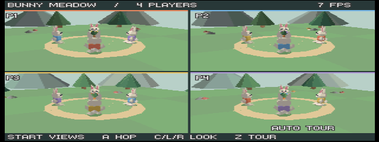

# Emulator verification — 2026-09-06

Built with Zig 0.16.0 and the pinned libdragon SDK. Loaded and inspected in
ares v147 through Computer Use, using the OpenGL backend, NTSC and homebrew
mode. The emulator reported approximately 60 video interrupts per second;
the game's FPS counter measures completed game frames separately.

## Layouts

All layouts show one shared meadow and the same four rabbits, with different
camera positions. The jersey colors identify the controller/player across
views. Nearer rabbits occlude farther objects through the RDP depth buffer.
The three-player arrangement fills the screen with one wide view above two
smaller views.

| Visible cameras | Observed FPS at the starting scene |
| --- | --- |
| 1 | 49 |
| 2 | 22 |
| 3 | 16 |
| 4 | 12 |

These are approximate observations, not hardware benchmarks or guaranteed
frame rates. Moving cameras regenerate scenery instead of using its cache;
the four-player tour is slower. Further CPU transform/submission optimization
or a batched RSP transform backend is needed for a faster game.

The following files are unedited ares captures. Ares saves the VI output at
640×240 with non-square pixels; the HTML display dimensions restore the
intended 4:3 aspect ratio without changing the captured files.

### One player

### Two players

### Three players

### Four players

## Motion and RDP validation

Built with `make VALIDATE=1 AUTOTOUR=1`, then observed the rabbits walking,
turning and hopping around the central carrot from all four cameras.
ISViewer tracing recorded 52 one-second validation heartbeats with no
`RDPQ_VALIDATION` warnings/errors and no triangle-capacity messages.
The [captured log](rdpq-validation.txt) records 7–8 FPS while validation is
enabled, with roughly 2,400 submitted triangles across all four views.

Validation caught an RDP fill-mode scissor requirement during development:
the right views now start at X=160, and their separator is drawn afterward.
A host test checks the required four-pixel alignment for every layout.

The final ROM uses the default four-player configuration, with profiling,
validation and the automatic tour disabled. Press Player 1 Z to enable the
tour, or rebuild with `AUTOTOUR=1` when no controllers are mapped.

## Automated checks and remaining coverage

- All 12 Zig host tests pass: controller isolation, view-count changes,
  jumping, world bounds, shared data layout, split geometry, near clipping,
  depth/viewport bounds, face winding, cache invalidation and animated scenes.
- ROM verification confirms big-endian N64 magic and a linked O64 ELF.
- The ABI guard confirms no implicit external calls and no `$gp` register
  use in the Zig object. Deliberately invalid objects were rejected by both
  checks during development.
- Zig formatting, shell syntax, Python syntax and `git diff --check` pass.

View counts were selected with `INITIAL_VIEWS` builds for visual checks.
The ares controller ports were unmapped, so live keyboard/gamepad control and
four physical controllers were not exercised. Packed controller behavior is
covered by the host tests. No real N64, M64 or SummerCart64 run was performed.

The editable Blender file, rendered preview and exported indexed mesh were
generated with Blender 5.2.1. Normal ROM builds use the generated mesh directly.
