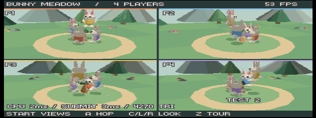
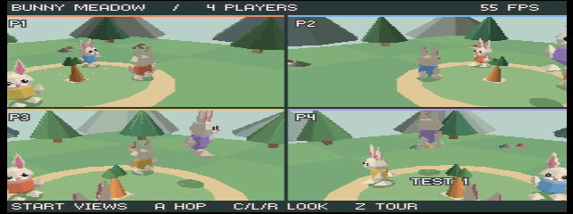
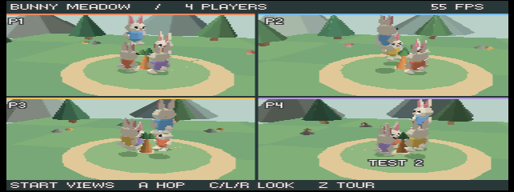
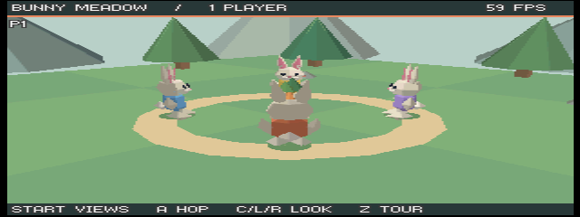
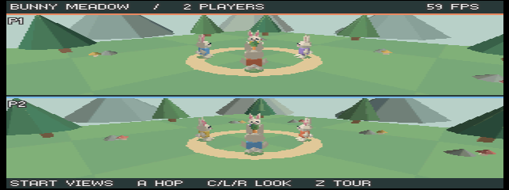
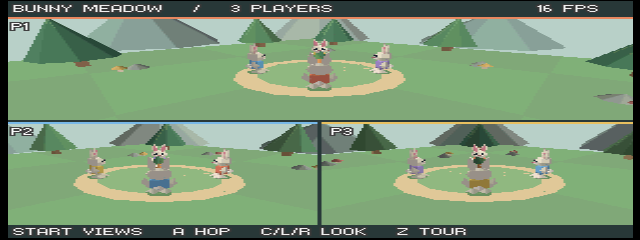
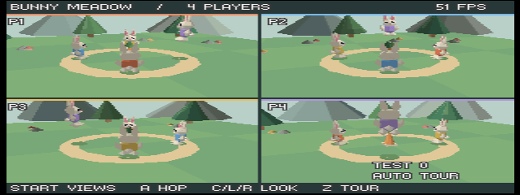
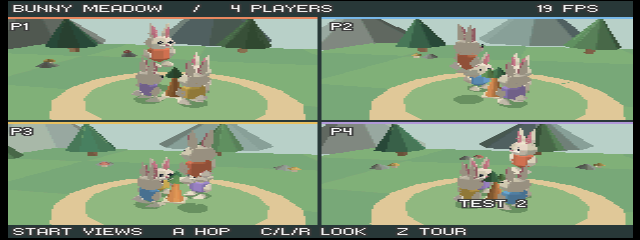

# Emulator verification — 2026-09-06

The initial template was checked in as `7d8ed1a` before optimization. That
renderer reached 12 FPS at rest and approximately 8 FPS with all four cameras
moving. Its measured CPU geometry/submission times were 68/51 ms in motion.

The optimized renderer retains the same Blender rabbit mesh, meadow, four
actors, controls and split layouts. Tiny3D now handles transforms, clipping
and triangle setup on the RSP; RDPQ still controls the RDP. Shared pose data,
recorded draw commands and per-camera visibility culling remove the previous
CPU bottleneck.

## Repeatable four-player performance test

Build with `just build --benchmark 1`, reload in ares v147, and record Cartridge
ISViewer output through Tools → Tracer → Log to File. The workload loops
through three 20-second phases with all four views active:

1. All four rabbits walk, hop and rotate their cameras around the meadow.
2. All four packed controller ports move and orbit independently.
3. Four rabbits hop close together while all cameras orbit them.

The first full optimized run, with the profile overlay enabled, recorded
110 one-second samples: **49–59 FPS**, with every sample above 40 FPS.
The final build recorded **115 one-second samples, all at 51–60 FPS**.
See the [raw performance capture](performance.txt).

| Four-player workload | Samples | Minimum–maximum FPS | Mean FPS |
| --- | ---: | ---: | ---: |
| Shared tour | 39 | 51–55 | 53.0 |
| Independent movement/orbit | 40 | 53–60 | 56.6 |
| Close-quarter hopping | 36 | 54–56 | 55.1 |

Benchmark ROM SHA-256:
`5412acf84a18b6d2746f0bada1106a384c7ded379ff07fb9ffd180fe4a049817`.

```sh
nu --no-config-file scripts/check-performance.nu docs/performance.txt --audio legacy --textured legacy
```

This historical capture has no content/material tags. Current captures include
those tags and must select `--textured off` or `--textured on`; the textured
workload has no recorded FPS result yet.

The checker requires four views throughout, at least 15 complete samples
from each phase, no diagnostic errors, and a minimum of 40 FPS in every sample.
These are render-loop measurements using the emulated N64 clock, not a real
console benchmark. Ares's separate VPS counter measures video interrupts on
the host; it was generally in the low-to-mid 50s during the stress screenshots.
At that emulator speed, the final 51+ game FPS still represents over 40
rendered frames per wall-clock second. Menus, debugger pauses, host load and
screenshot capture can temporarily affect emulator speed.

The framebuffer remains 320×240 with standard antialiasing and 16-bit depth.
No view or rabbit is updated at a reduced frequency to obtain these results.
The CPU pose update is approximately 2–3 ms; submission timing includes queue
backpressure while the RSP is busy.

## Pictures taken during optimization

These are unedited ares screenshots. The emulator saves the VI output at
640×240 with non-square pixels; the HTML display dimensions restore 4:3
without altering the image files.

### Four players in close quarters — 52 FPS



### Independent controller movement — 56 FPS



### Benchmark before the path fix — 55 FPS



### One-player layout — 59 FPS



### Two-player layout — 59 FPS



### Three-player layout — 59 FPS



### Default four-player layout — 55 FPS


### Final path mesh under four-player motion — 51 FPS



The [two-player picture](screenshots/optimization/path-before-fix.png) exposed Z fighting between overlapping grass and
path discs. The final path is a non-overlapping annulus above the meadow;
the corrected layout pictures show a clean ring without the stippled streaks.

## Hardware command validation and correctness

`just build --benchmark 1 --validate 1` completed **199 one-second diagnostic samples**
across all three phases with no `RDPQ_VALIDATION` errors or warnings.
See the [captured validation log](rdpq-validation.txt). Validation adds heavy
instrumentation overhead, so that build is excluded from performance acceptance.
After the path fix, a further **67 samples** of the four-player tour also
completed without validation errors; see the [final geometry log](rdpq-validation-final.txt).



All 12 host tests pass. They cover controller isolation and persistent actors,
world bounds, jumping/recentering edges, split geometry and RDP alignment,
packed vertex/mesh layouts, RSP batch budgets, overflow detection, frame-slot
isolation, and conservative visibility bounds throughout a complete benchmark.
The ROM verifier confirms N64 big-endian magic, the O64 ELF, no implicit
external calls from Zig, and a reserved global pointer. Zig formatting,
Nu script parsing, and `git diff --check` also pass.

Live physical gamepads and real N64, M64 or SummerCart64 hardware were not
available for this run. The benchmark drives the same packed input interface
as four controller ports. The ares controller mappings were left untouched.

The final ROM SHA-256 is
`78cb82baeac8cf52645ac7ab774f6e399343ac9412a29b52e3e269b212fe501c`.

The final ROM starts in four-player mode with benchmark, profiling, validation
and automatic tour disabled. Player 1 Start cycles layouts; Z enables the tour.
The editable Blender 5.2.1 source and its 130-vertex/188-triangle rabbit are
unchanged by the renderer optimization.


## Audio integration: validation still pending

The original graphics-only captures above use benchmark workload 1. Audio
integration changes the final phase to simultaneous four-player hops and labels
its PERF records `workload=2 audio=0|1`. New `AUDIO=0` and `AUDIO=1` ROMs run the
same workload for comparison. The old FPS range does not establish the new
combined graphics/audio budget.

Host event/parser tests and ROM/ABI builds validate the integration's code and
packaging. Interactive listening, pause/reset latency, four-effect overlap and
sustained workload-2 performance still need emulator or hardware observation;
no such results are claimed here. Follow [the comparison procedure](audio.md#benchmark-comparison).
