# Template showcase

Fresh captures from the template PRs, taken in **ares v147 through Computer Use**
on September 17–18, 2026. These are real ROM frames saved with ares's
**Tools → Capture Screenshot**, with no image editing. Native VI captures are
640×240 with non-square pixels; the display dimensions below restore **4:3**.

Each picture has an exact source commit, build options, ROM SHA-256 and image
SHA-256 in [captures.json](captures.json). Captures belong to the recorded
builds, including where an earlier PR is already merged; they are not all from
the same final ROM.
The native filenames retain ares's local capture times in America/Los_Angeles;
`collected_at` records when each PNG was copied into this gallery.

**Publication status:** this gallery update changes documentation and images
only. The audio repair (`30435da`) and combined repaired build (`b377ec9`) were
tested locally; publishing the repair and restacking PRs #11–#14 awaits owner
approval. Those two source commits are not yet available from GitHub. The
unrepaired audio benchmark in the current PR stack still has the assertion
shown below. Candidate screenshots are evidence for the proposed fix, not for
the currently published runtime code.

## Combined template

Four cameras, textured ground, explicit obstacles, multiplayer lifecycle and
streamed audio running together on a **local candidate** based on the
[PR #14](https://github.com/jeremybanka/n64-3d-splitscreen/pull/14) stack after
the audio fix below. The benchmark remained running for over two wall-clock
minutes and reached the simultaneous-hop `TEST 2` phase without an assertion.

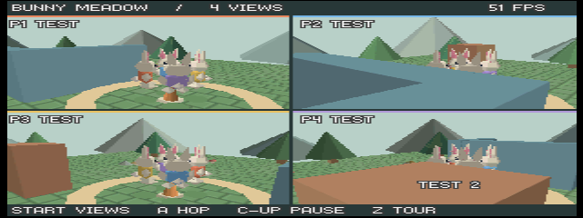

The same combination with RDPQ validation compiled in

The validation ROM also rendered and advanced to `TEST 2`. Its additional
instrumentation is excluded from performance comparisons. No complete ISViewer
log was collected, so this picture does not certify a clean RDP command trace.

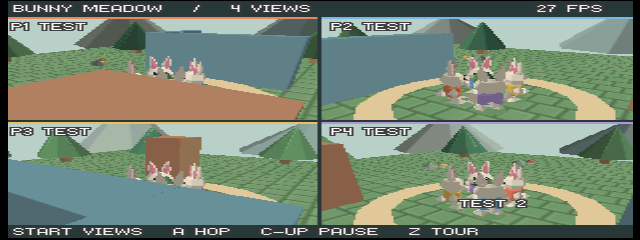

## Shared world and controller lifecycle

Four cameras look into one meadow, with persistent characters and a small
control legend. Disconnecting a virtual controller marks its port `OFF` while
retaining that player's rabbit and view.

| Four active ports · [PR #8](https://github.com/jeremybanka/n64-3d-splitscreen/pull/8) | Virtual port 2 disconnected |
| --- | --- |
| 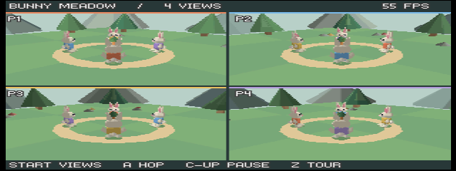 | 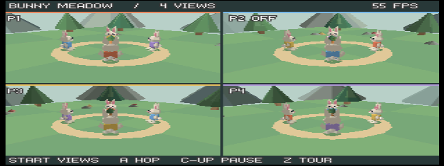 |

The ares menu was used to switch port 2 from Gamepad to Nothing and back.
`P2 OFF` appeared on disconnect and disappeared on reconnect. This checks the
visible connection policy; it does not replace physical controller testing or
the full pause/reset/input-rearming checklist.

## Replaceable content

The alternate robot courtyard changes the character, colors, movement recipe
and scenery through the asset/content workflow in
[PR #10](https://github.com/jeremybanka/n64-3d-splitscreen/pull/10).
The same shared-world renderer handles a single camera and four quadrants.

| One view | Four views |
| --- | --- |
| 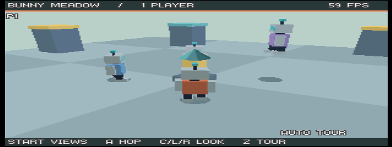 | 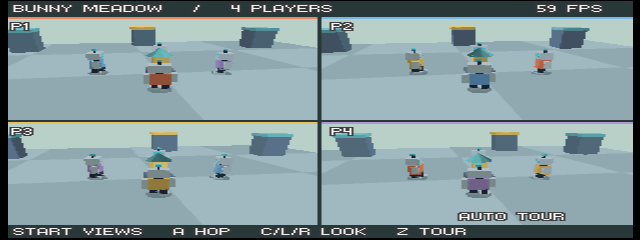 |

## Optional textured ground

[PR #12](https://github.com/jeremybanka/n64-3d-splitscreen/pull/12) adds a
repeating ground material alongside flat-shaded characters and scenery. Both
content packs are shown here. These two rendering checks explicitly used
`--audio 0`; the combined build is recorded separately.

| Meadow · one camera | Courtyard · four cameras |
| --- | --- |
| 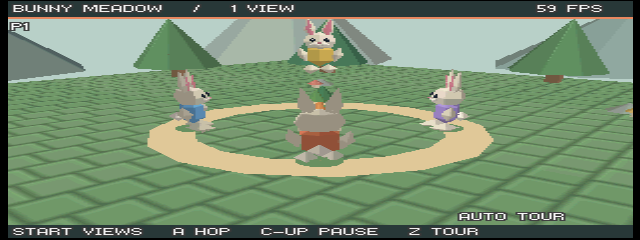 | 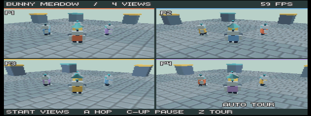 |

## Explicit obstacle scene

[PR #13](https://github.com/jeremybanka/n64-3d-splitscreen/pull/13) adds three
solid boxes, including an L-shaped wall. The single-view tour shows the brown
block behind the group; the four-view benchmark shows the obstacles around
the simultaneous-hop phase. Camera shortening can bring the rabbit close to
the eye near a wall. A camera entering the player mesh was observed in the
combined benchmark: the current point-camera example still needs a game-level
choice of minimum distance, character fading or a different obstruction policy.
These isolated captures use `--audio 0`.

| One-view tour | Four-view benchmark |
| --- | --- |
| 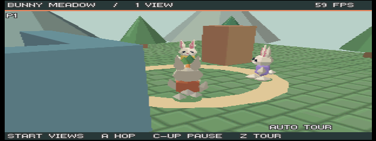 | 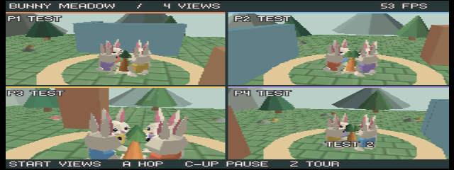 |

These pictures establish that the demo renders and advances. Interactive
wall-sliding, corner traversal and camera-feel checks remain part of the
[collision playtest procedure](../docs/collision.md#verification-and-limits).

## Audio runtime regression caught by the capture pass

The original [PR #11](https://github.com/jeremybanka/n64-3d-splitscreen/pull/11)
benchmark reached a libdragon assertion: `invalid read past end: 504 vs 252`.
Four hop channels shared one mutable VADPCM decoder. The proposed fix gives each port
its own decoder while retaining a single ROM asset, and adds a host streaming
regression that fails the old implementation.

The locally repaired audio-enabled ROM ran for over two wall-clock minutes. `TEST 2`,
the simultaneous-hop phase, was observed twice over a minute apart without
the assertion. This is playback-path smoke evidence; no listening quality
or sustained performance result is inferred from the screenshot.

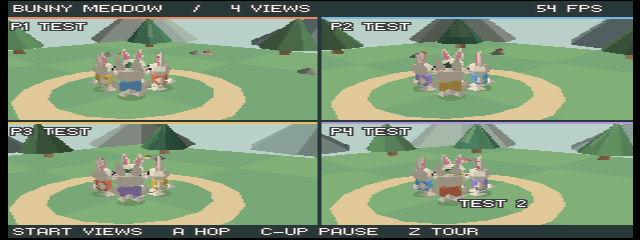

Before the fix: native assertion capture

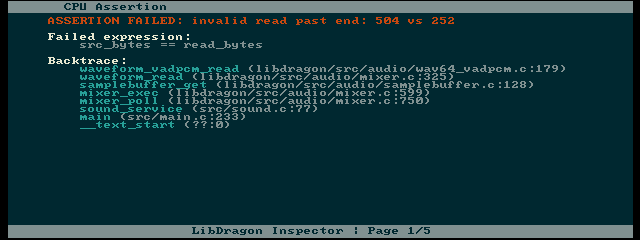

## Reproducible foundation

The Nushell/Just toolchain in
[PR #9](https://github.com/jeremybanka/n64-3d-splitscreen/pull/9) builds the
original four-view meadow. This frame is from that PR's own head, before the
later lifecycle, audio, material and collision integrations.

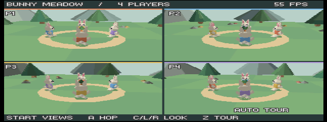

## Capture environment and limits

- macOS, pinned ares **v147**, **OpenGL 3.2**. Homebrew Development Mode was
  enabled for diagnostic runs; the two final texture-only captures used the
  ordinary mode. The manifest records that setting per image.
- Expansion Pak enabled: **8 MiB emulated RDRAM**. This run does not establish
  the 4 MiB acceptance target.
- ROMs built with the pinned mise tools and SDK dependencies. Every captured
  variant passed the ROM/header and Zig ABI verifier before loading.
- Build switches in the manifest are arguments to `just build`. Unspecified
  options retain the defaults of the recorded source commit.
- HUD FPS numbers are individual observations, not sustained performance
  measurements. Screenshots do not establish audio quality, absence of mixer
  glitches, or RDP validation-log cleanliness.
- These are emulator smoke checks. Physical hardware, region coverage,
  listening checks, and the longer [release gate](../docs/release-gate.md)
  remain separate.

To reproduce a published-commit picture, check out its manifest commit, run `mise install` and
`just setup`, then `just build` with its `args`. Run
`nu --no-config-file scripts/verify-rom.nu` after the build, load the resulting
ROM in ares v147, and use the native screenshot
command. Autotour and benchmark frames vary with capture time.
